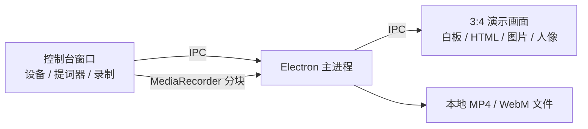

# ABAO Presenter

<p align="center">
  
</p>

<p align="center">
  本地优先的竖屏演示录制工作台：白板、动态 HTML、图片、摄像头人像和提词器，一次完成。
</p>

<p align="center">
  <a href="https://github.com/abao-ai-lab/abao-presenter/releases">下载安装包</a> ·
  <a href="PRIVACY.md">隐私说明</a> ·
  <a href="README_EN.md">English</a>
</p>


> 当前为早期公开版本。建议先录制一段 10 秒样片，确认摄像头、麦克风和成片格式正常，再开始正式录制。

## 为什么做它

录制知识类、教程类和自媒体视频时，常常要同时处理演示页面、白板、摄像头人像和口播稿。ABAO Presenter 将这些能力放进两个窗口：

- **演示画面**：固定 3:4 比例，只包含最终要录进视频的内容。
- **录制控制台**：管理素材、设备、提词器和录制状态，不会进入成片。

所有素材和录制文件都保留在本机，不需要账号，也不会上传到云端。

## 功能

- 3:4 竖版演示画面，目标分辨率 1080 × 1440、30 FPS
- 轻量白板：画笔、橡皮擦、文字、撤销、草稿恢复
- 加载本地动态 HTML，并保留页面交互、动画和同目录资源
- 展示 PNG、JPG、WebP、GIF 图片
- 摄像头人像浮窗，可拖动、缩放并切换圆形或圆角方形
- 鼠标强调与点击波纹
- 独立提词器，支持字号、速度和自动滚动
- 分块写入本地文件，降低长时间录制的内存占用
- macOS 优先输出 MP4；系统不支持时自动降级为 WebM

## 界面预览

| 录制控制台 | 演示画面 |
| --- | --- |
|  |  |

## 安装

### macOS

1. 打开 [Releases](https://github.com/abao-ai-lab/abao-presenter/releases)，下载与你芯片匹配的 `.dmg`。
2. 将 `ABAO Presenter` 拖入“应用程序”。
3. 首次启动时按系统提示授予摄像头、麦克风和屏幕录制权限。

目前公开安装包未进行 Apple 公证。如果 macOS 阻止首次打开，请在 Finder 中右键应用并选择“打开”。请只从本仓库 Releases 下载。

## 使用

1. 在控制台选择白板、动态 HTML 或图片。
2. 选择摄像头和麦克风，按需调整人像、背景和鼠标效果。
3. 将口播稿粘贴到提词器并设置滚动速度。
4. 点击“开始录制”，在系统选择器中确认 ABAO Presenter 演示画面。
5. 完成后点击“停止录制”，再点击“录制文件”查看成片。

安装版默认将视频保存到系统“影片/ABAO Presenter”目录。源码开发模式保存到项目的 `recordings/` 目录。

## 从源码运行

需要 Node.js 20 或更高版本，以及 macOS。

```bash
git clone https://github.com/abao-ai-lab/abao-presenter.git
cd abao-presenter
npm ci
npm start
```

常用命令：

```bash
npm run check      # ESLint + 生产构建
npm run dist:mac   # 构建 Apple Silicon 的 DMG 和 ZIP
```

## 架构



主进程只通过受限的 preload API 暴露必要能力，渲染进程启用 `contextIsolation` 和沙箱。更多细节见 [架构说明](docs/ARCHITECTURE.md)。

## 当前边界

- PPT 请先导出为图片；暂不直接播放 PPT 动画。
- 依赖浏览器扩展、复杂登录态或跨域接口的 HTML 可能需要单独适配。
- HTML 新开的独立窗口不会自动进入演示画面，建议使用页面内弹层。
- 当前重点验证 macOS；Windows 安装包尚未进入公开发布流程。

## 参与贡献

欢迎提交 Issue 和 Pull Request。开始前请阅读 [CONTRIBUTING.md](CONTRIBUTING.md) 与 [SECURITY.md](SECURITY.md)。

## 许可证

项目代码采用 [MIT License](LICENSE)。第三方依赖说明见 [THIRD_PARTY_NOTICES.md](THIRD_PARTY_NOTICES.md)。
