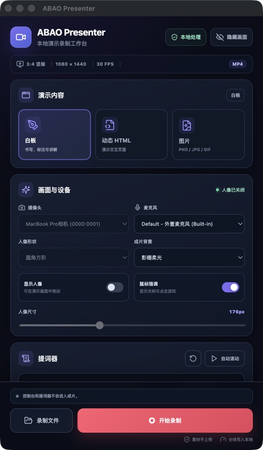
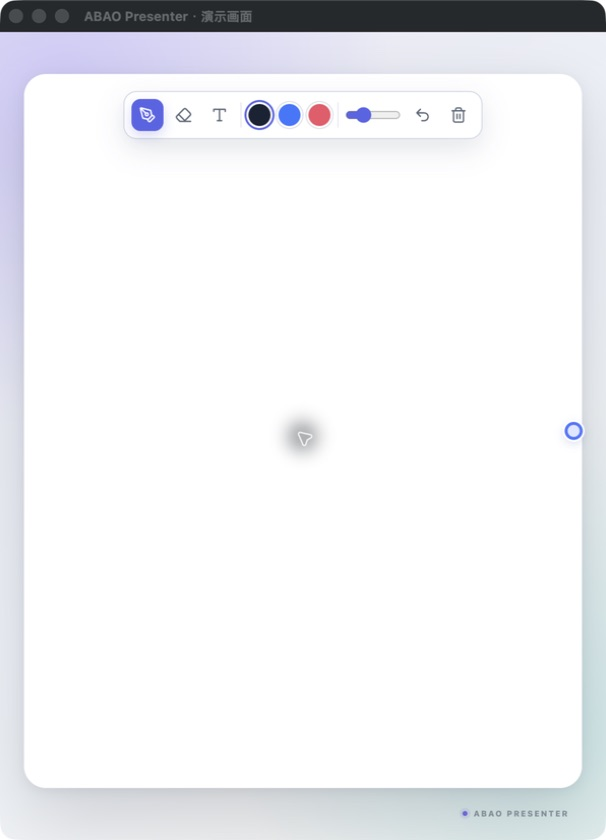
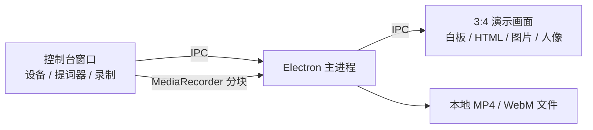

# ABAO Presenter

<p align="center">
  
</p>

<p align="center">
  本地优先的竖屏演示录制工作台：白板、动态 HTML、图片、摄像头人像和提词器，一次完成。
</p>

<p align="center">
  <a href="https://github.com/abao-ai-lab/abao-presenter/releases/latest"><strong>下载最新版</strong></a> ·
  <a href="PRIVACY.md">隐私说明</a> ·
  <a href="README_EN.md">English</a>
</p>


> 当前为早期公开版本。建议先录制一段 10 秒样片，确认摄像头、麦克风和成片格式正常，再开始正式录制。

## 下载软件

无需安装开发环境，按电脑系统下载对应安装包即可。所有正式安装包都发布在 [GitHub Releases](https://github.com/abao-ai-lab/abao-presenter/releases/latest)。

| 系统 | 下载 | 适用设备 |
| --- | --- | --- |
| macOS Apple 芯片 | [下载 DMG](https://github.com/abao-ai-lab/abao-presenter/releases/latest/download/ABAO-Presenter-0.2.0-arm64.dmg) | M1 / M2 / M3 / M4 / M5 Mac |
| macOS Intel 芯片 | [下载 DMG](https://github.com/abao-ai-lab/abao-presenter/releases/latest/download/ABAO-Presenter-0.2.0-x64.dmg) | Intel Mac |
| Windows 64 位 | [下载安装版 EXE](https://github.com/abao-ai-lab/abao-presenter/releases/latest/download/ABAO-Presenter-0.2.0-x64.exe) | Windows 10 / 11 |

不确定 Mac 芯片类型时，点击屏幕左上角苹果菜单 →“关于本机”查看“芯片”或“处理器”。

### macOS 安装（首次打开必看）

> **为什么会提示风险？** 当前安装包没有使用 Apple Developer 证书进行官方签名和公证，因此 macOS Gatekeeper 可能提示“无法验证开发者”“Apple 无法检查其是否包含恶意软件”或阻止打开。这是未公证应用的系统提示，并不代表软件被检测出病毒。请只从本仓库的 [Releases](https://github.com/abao-ai-lab/abao-presenter/releases/latest) 下载。

1. 下载与你芯片匹配的 `.dmg`，双击打开。
2. 将 `ABAO Presenter` 拖入“应用程序”文件夹。
3. 打开 Finder →“应用程序”，按住 `Control` 点击（或右键点击）`ABAO Presenter`，选择“打开”。
4. 在弹出的风险提示中再次点击“打开”。通过这种方式打开一次后，以后可以正常双击启动。

如果弹窗里没有“打开”按钮：

1. 先尝试启动一次软件并关闭风险提示。
2. 打开苹果菜单 →“系统设置”→“隐私与安全性”。
3. 向下找到“已阻止使用 ABAO Presenter”，点击“仍要打开”。
4. 使用登录密码或 Touch ID 确认，然后在新弹窗中点击“打开”。

首次录制时，请根据系统提示允许以下权限：

- **摄像头**：显示人像画面。
- **麦克风**：录制讲解声音。
- **屏幕与系统音频录制**：录制演示窗口。授予这项权限后，请完全退出并重新打开软件。

如果确认安装包来自本仓库，但系统仍提示“应用已损坏”或无法打开，可先下载 [SHA256SUMS.txt](https://github.com/abao-ai-lab/abao-presenter/releases/latest/download/SHA256SUMS.txt) 校验文件，然后在终端执行：

```bash
xattr -dr com.apple.quarantine "/Applications/ABAO Presenter.app"
```

执行后回到“应用程序”文件夹，再次右键软件并选择“打开”。**不要对来源不明的软件执行这条命令。**

### Windows 安装

1. 下载 `ABAO-Presenter-0.2.0-x64.exe` 并双击运行。
2. 按安装向导选择安装目录并完成安装。
3. 如果 Windows SmartScreen 弹出保护提示，确认文件来自本仓库后，点击“更多信息”→“仍要运行”。
4. 第一次录制时允许软件使用摄像头和麦克风。

当前安装包未购买商业代码签名证书，因此 Windows 可能显示“未知发布者”。可使用 Release 中的 `SHA256SUMS.txt` 校验下载文件。

## 为什么做它

录制知识类、教程类和自媒体视频时，常常要同时处理演示页面、白板、摄像头人像和口播稿。ABAO Presenter 将这些能力放进两个窗口：

- **演示画面**：固定 3:4 比例，只包含最终要录进视频的内容。
- **录制控制台**：管理素材、设备、提词器和录制状态，不会进入成片。

所有素材和录制文件都保留在本机，不需要账号，也不会上传到云端。

## 功能

- 3:4 竖版演示画面，目标分辨率 1080 × 1440、30 FPS
- 轻量白板：画笔、橡皮擦、文字、撤销、草稿恢复
- 加载本地动态 HTML，并保留页面交互、动画和同目录资源
- 展示 PNG、JPG、WebP、GIF 图片
- 摄像头人像浮窗，可拖动、缩放并切换圆形或圆角方形
- 鼠标强调与点击波纹
- 独立提词器，支持字号、速度和自动滚动
- 分块写入本地文件，降低长时间录制的内存占用
- macOS 优先输出 MP4；系统不支持时自动降级为 WebM

## 界面预览

| 录制控制台 | 演示画面 |
| --- | --- |
|  |  |

## 使用

1. 在控制台选择白板、动态 HTML 或图片。
2. 选择摄像头和麦克风，按需调整人像、背景和鼠标效果。
3. 将口播稿粘贴到提词器并设置滚动速度。
4. 点击“开始录制”，在系统选择器中确认 ABAO Presenter 演示画面。
5. 完成后点击“停止录制”，再点击“录制文件”查看成片。

安装版默认将视频保存到系统“影片/ABAO Presenter”目录。源码开发模式保存到项目的 `recordings/` 目录。

## 从源码运行

需要 Node.js 20 或更高版本。支持在 macOS 和 Windows 上进行开发。

```bash
git clone https://github.com/abao-ai-lab/abao-presenter.git
cd abao-presenter
npm ci
npm start
```

常用命令：

```bash
npm run check      # ESLint + 生产构建
npm run dist:mac   # 构建 Apple Silicon 的 DMG 和 ZIP
npm run dist:win   # 在 Windows 上构建 64 位安装包
```

## 架构



主进程只通过受限的 preload API 暴露必要能力，渲染进程启用 `contextIsolation` 和沙箱。更多细节见 [架构说明](docs/ARCHITECTURE.md)。

## 当前边界

- PPT 请先导出为图片；暂不直接播放 PPT 动画。
- 依赖浏览器扩展、复杂登录态或跨域接口的 HTML 可能需要单独适配。
- HTML 新开的独立窗口不会自动进入演示画面，建议使用页面内弹层。
- Windows 与 macOS 安装包均由 GitHub Actions 自动构建；当前均未进行商业代码签名。

## 参与贡献

欢迎提交 Issue 和 Pull Request。开始前请阅读 [CONTRIBUTING.md](CONTRIBUTING.md) 与 [SECURITY.md](SECURITY.md)。

## 许可证

项目代码采用 [MIT License](LICENSE)。第三方依赖说明见 [THIRD_PARTY_NOTICES.md](THIRD_PARTY_NOTICES.md)。
